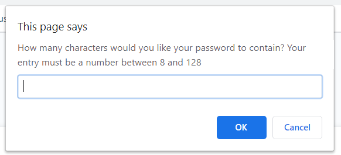
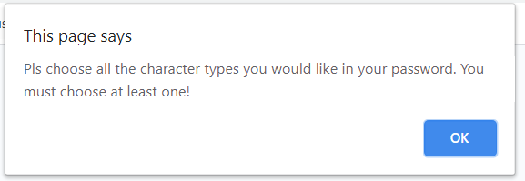
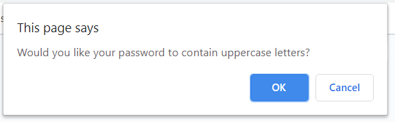
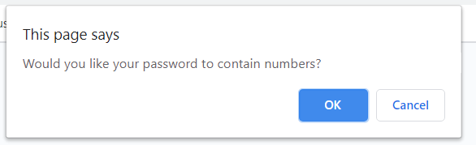
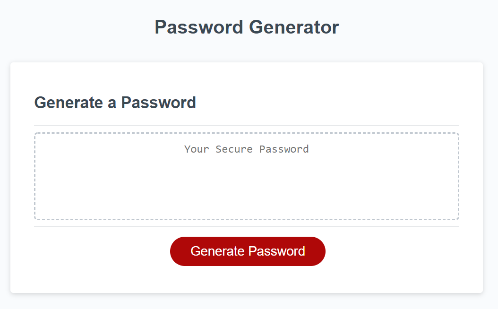
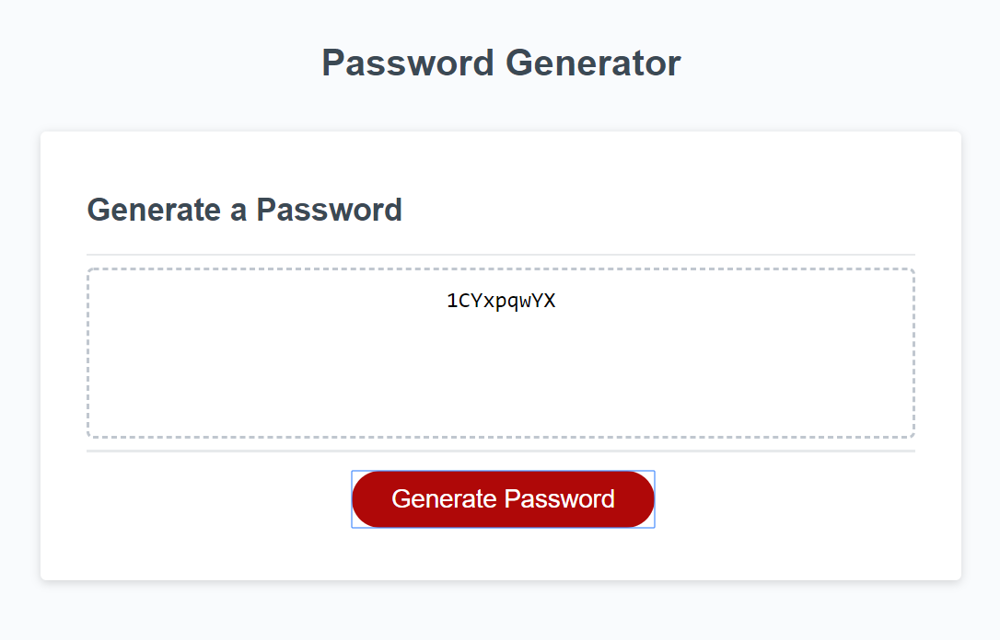

# 03 JavaScript: Password Generator
This application generates a random password based on user-selected criteria. This app will run in the browser and feature dynamically updated HTML and CSS powered by JavaScript code. It will also feature a clean and polished user interface and be responsive, ensuring that it adapts to multiple screen sizes.

## User Story

```
This is for employees with access to sensitive data
to randomly generate a password that meets certain criteria
It creates a strong password that provides greater security
```

## Project walkthough

```
GIVEN I need a new, secure password
WHEN I click the button to generate a password
THEN I am presented with a series of prompts for password criteria
WHEN prompted for password criteria
THEN I select which criteria to include in the password
WHEN prompted for the length of the password
THEN I choose a length of at least 8 characters and no more than 128 characters

WHEN prompted for character types to include in the password
THEN I choose lowercase, uppercase, numeric, and/or special characters






WHEN I answer each prompt
THEN my input is validated and at least one character type should be selected
WHEN all prompts are answered
THEN a password is generated that matches the selected criteria
WHEN the password is generated
THEN the password is written to the page


```


